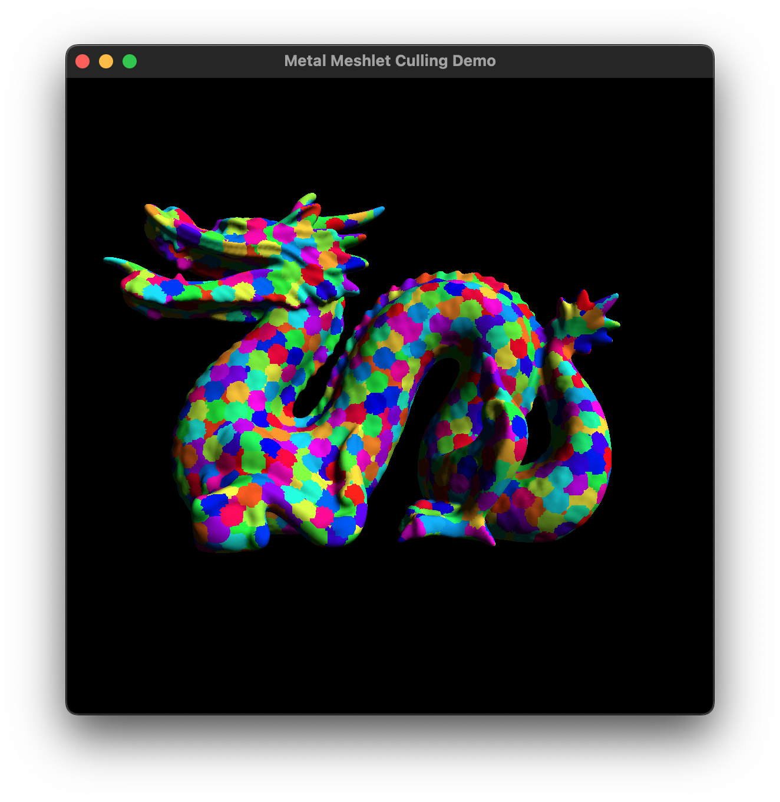

# Metal Meshlet Culling Demo

A simple example of how to use Metal mesh shaders to perform coarse visibility determination of meshlets by frustum culling and normal
cone culling.

System requirements: Xcode 14, macOS 13.0, Metal 3.0

